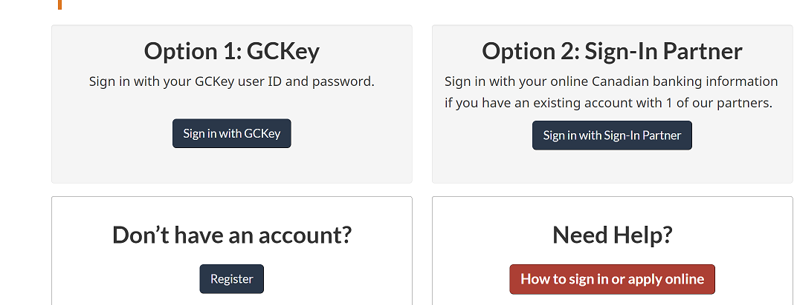
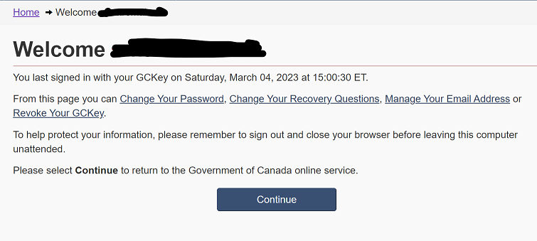
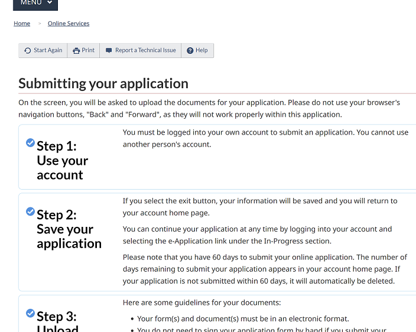
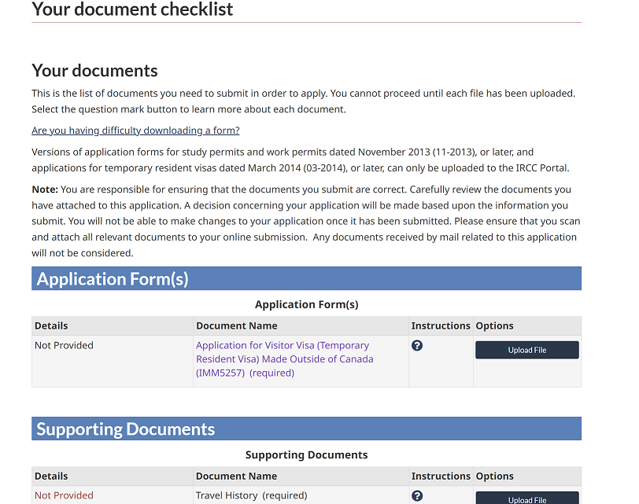

# Steps to apply for a Canada Visa

> **_DISCLAIMER:_** I am not an immigration attorney. Just sharing my experience when I applied for visitors visa in Dec 2022.

## Create a login to application website

1. Go to link: [HomePage](https://www.canada.ca/en/immigration-refugees-citizenship/services/application/account.html) and choose appropriate option.
   1. If you never had an account: Select 'Don't have an Account? Register'. And then select 'Register with GCKey'Option 1: GCKey
   2. If/once you have an account: Go to HomePage and select Option 1: GCKey   

> **_NOTE:_** They keep logging out users.It's easy to get lost between web pages to log back in. Keep [HomePage](https://www.canada.ca/en/immigration-refugees-citizenship/services/application/account.html) handy

1. At Welcome page, hit continue

    

    1. Accept Terms and Conditions on the next page
    2. Fill in Identity validation that were provided when the account was registered. It will take you to your account home page.
    3. On this page, Select 'Start an Application' : Apply to come to Canada
    4. Page 'Personal Checklist' opens. Here in the section 'I don't have a personal reference code' select 'Visitor visa, study and/or work permit'
    5. Fill in answers on 'Find out if you're eligible to apply'
       1. What would you like to do in Canada? <em>Visit</em>
       2. How long are you planning to stay in Canada? <em>Temporarily - less than 6 months</em>
       3. Select the code that matches the one on your passport <em>IND</em>
       4. What is your current country/territory of residence? If you are presently in Canada, you should select Canada <em>United states of america</em>
       5. Do you have a family member who is a Canadian citizen or permanent resident and is 18 years or older? <em>No</em>
       6. What is your date of birth <em>yyyy/mm/dd</em>
       7. Have you lived in Canada as a permanent resident or landed immigrant? <em>No</em>
       8. Are you a lawful permanent resident of the United States with a valid U.S. Citizenship and Immigration Services (USCIS) number? <em>No</em>
       9. What is your marital status? <em>whatever</em>
       10. What is your province of destination? If visiting multiple provinces, select the one in which you will be spending most of your time. <em>whatever</em>

2. Base on your answers you will be notified which visa you are eligible to apply Hit Continue. On the next page:
   1. What is the main purpose of your visit? <em>Tourism</em>
   2. On the next page, put appropriate answers to all the questions.
   3. On one of the pages Question: Do you want to submit an application for a family member? <em>Yes, if you are going with family</em>
   4. If you answered Yes to family memner question it asks you about your family member otherwise asks common questions like have you committed a crime and all
   5. Once you get through the long list of questions, it will land on review page. Review and hit 'Continue'

        

3. On this page first form is IMM5257 
   1. **Right click on the link and save it as PDF**
   2. **Do not open this PDF in a browser. It will not work. Use a pdf reader software like adobe**
   3. Questions in this form are fairly common except:
      1. Do you have a national identity document? No
      2. In the section: Details of visit to Canada
         1. Funds available for my visit <em>10000 CAD is enough</em>
         2. Name, address and relationship of any person(s) or institution(s) I will visit <em>Hotel name and address. You can book cancellable stay to show</em>
      3. In Signature textbox I put my name.
      4. Validate and save. 

4. In supporting documents fill form IMM5645. Didn't find anything tricky in this one so I am going to skip.

### Documents needed
Main documents in this section are:
   1. proof of financial support. I clubbed folowing documents in one pdf and uploaded.
      - Letter from employer showing my current work status
      - Paystubs (3 recent)
      - Bank statements (Checking and savings)
   2. Purpose of travel. Uploaded hotel booking

### Pay and submit online application
Pay with a credit card and submit your application.

## Take a biometrics appointment
- Once the documents are complete and the online application is submitted. You will get an email to get a biometrics appointment. Log back in to your account and it will show show you Biometrics Instructions Letter. This letter will have detailed information about where to take an appointment and what to bring to the appointment.
- Attend your appointment. In a few days you will get an email asking to submit your passport to get a stamp.

## Send your passport for the stamp
- Final stage in this process is to send your passport for the stamp to one of the vfs global offices. You must wait until you get an update from IRCC about submitting your passport. You will receive 'Original passport request letter' in you IRCC account. It will mostly mention requirements.
- In the letter there will be a link to find your closest VAC to send your passsport.
- You do not need to give biometrics again if you already attended your appointment.
- Create a money order tp pay 'Package Transmission service charge'
  - Below charges must be paid in a form of a Money Order or Cashier’s check (over 3 months validity period) in favour of “VFS Services (USA) Inc.” and fees must be in US dollars
  - Package transmission (per passport) – $23.30 USD (** If you have enrolled biometrics at Canada Visa Application Centre in New York, you do not need to pay this fee.
- I opted for two way mail as I wanted to be safe. 
- VAC page explaining the process: https://visa.vfsglobal.com/usa/en/can/apply-visa
  

- Get the documents ready to send in a mail.
  - Passport
  - Your contact information, including your email, phone number and return address
  - Original passport request letter
  - The VAC consent forms (available on their Web site)
  - Money order for processing fees
  - confirmation letter for the 2 way courier

- Send this package by printing the label and wait until your passport comes back in mail.
